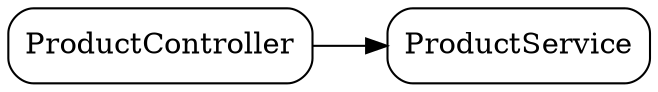

# CodeLens Server API Reference

The CodeLens server exposes a REST API for bytecode analysis. All endpoints return JSON responses.

## Base URL

```
http://127.0.0.1:{port}
```

The server binds to localhost by default. Port is automatically assigned from the range 61000-65535 (the IANA dynamic/private range, chosen to avoid collisions with other programs). The CLI discovers the actual port from the server's ready-line and state file, so the specific number is rarely relevant.

## Admin Endpoints

These endpoints manage server health and lifecycle.

### GET /admin/health

Health check endpoint.

**Response:**
```json
{
  "status": "UP",
  "timestamp": "2026-01-05T12:34:56.789Z"
}
```

### GET /admin/ready

Readiness check - indicates if the server has completed scanning. Returns `503` with `"ready": false` while the initial scan is still running.

**Response:**
```json
{
  "ready": true,
  "status": "READY",
  "project": "my-project"
}
```

### GET /admin/info

Server information including version, uptime, and configuration.

**Response:**
```json
{
  "version": "0.1.0",
  "apiVersion": "v1",
  "projectPath": "/path/to/project",
  "projectName": "my-project",
  "port": 61337,
  "host": "127.0.0.1",
  "status": "READY",
  "startedAt": "2026-01-05T12:00:00.000Z",
  "uptime": "5m 30s",
  "lastActivityAt": "2026-01-05T12:05:00.000Z",
  "idleDuration": "30s",
  "idleTimeout": "30m"
}
```

### POST /admin/activity

Touch activity to reset the idle timer. Used by the CLI to keep the server alive.

**Response:**
```json
{
  "lastActivityAt": "2026-01-05T12:05:30.000Z"
}
```

### POST /admin/shutdown

Graceful shutdown (localhost only). Returns `403` for non-localhost callers.

**Response:**
```json
{
  "status": "shutting_down"
}
```

---

## Project Endpoints

### GET /api/v1/project

Get project information.

**Response:**
```json
{
  "name": "my-project",
  "path": "/path/to/project",
  "status": "READY",
  "classCount": 150,
  "scannedAt": "2026-01-05T12:00:05.000Z"
}
```

### POST /api/v1/project/refresh

Trigger a refresh of the project scan (after code changes). Returns the project info reflecting the new scan state.

**Response:**
```json
{
  "name": "my-project",
  "path": "/path/to/project",
  "status": "LOADING"
}
```

---

## Analysis Endpoints

### GET /api/v1/stats

Get scan statistics for the codebase.

**Response:**
```json
{
  "projectClassCount": 150,
  "libraryClassCount": 2500,
  "jdkClassCount": 8000,
  "projectInterfaceCount": 25,
  "projectAbstractClassCount": 10,
  "projectEnumCount": 8,
  "projectAnnotationCount": 3,
  "projectMethodCount": 1200,
  "projectFieldCount": 450,
  "classpathResolvedBy": "GradleToolingAPI",
  "classpathEntryCount": 85,
  "scanDurationMs": 1250,
  "scannedAt": "2026-01-05T12:00:05.000Z"
}
```

---

### GET /api/v1/classes

List classes with optional filtering and pagination.

**Query Parameters:**

| Parameter | Type | Default | Description |
|-----------|------|---------|-------------|
| `package` | string | - | Filter by package pattern (supports `*` wildcard) |
| `name` | string | - | Filter by class name pattern (supports `*` wildcard) |
| `annotation` | string | - | Filter to classes with this annotation |
| `extends` | string | - | Filter to classes extending this class |
| `implements` | string | - | Filter to classes implementing this interface |
| `interfaces` | boolean | `false` | Only show interfaces |
| `includeLibraries` | boolean | `false` | Include library classes |
| `page` | int | `0` | Page number (0-based) |
| `size` | int | `50` | Page size |

**Example:**
```
GET /api/v1/classes?package=com.example.web.*&annotation=org.springframework.web.bind.annotation.RestController
```

**Response:**
```json
{
  "classes": [
    {
      "fqn": "com.example.web.ProductController",
      "simpleName": "ProductController",
      "packageName": "com.example.web",
      "source": "PROJECT",
      "isInterface": false,
      "isAbstract": false,
      "isEnum": false,
      "isAnnotation": false,
      "methodCount": 5,
      "fieldCount": 2
    }
  ],
  "totalCount": 3,
  "page": 0,
  "pageSize": 50,
  "totalPages": 1,
  "appliedFilter": {
    "packagePattern": "com.example.web.*",
    "namePattern": null,
    "source": "PROJECT",
    "hasAnnotation": "org.springframework.web.bind.annotation.RestController",
    "extendsClass": null,
    "implementsInterface": null
  }
}
```

---

### GET /api/v1/classes/{fqn}

Get full details for a specific class.

**Path Parameters:**

| Parameter | Description |
|-----------|-------------|
| `fqn` | Fully qualified class name (e.g., `com.example.web.ProductController`) |

**Example:**
```
GET /api/v1/classes/com.example.web.ProductController
```

**Response:**
```json
{
  "classInfo": {
    "name": {
      "fqn": "com.example.web.ProductController",
      "simpleName": "ProductController",
      "packageName": "com.example.web"
    },
    "source": "PROJECT",
    "visibility": "PUBLIC",
    "isInterface": false,
    "isAbstract": false,
    "isFinal": false,
    "isEnum": false,
    "isAnnotation": false,
    "isSynthetic": false,
    "superclass": "com.example.web.BaseController",
    "interfaces": [],
    "annotations": [
      {
        "type": "org.springframework.web.bind.annotation.RestController",
        "parameters": {}
      },
      {
        "type": "org.springframework.web.bind.annotation.RequestMapping",
        "parameters": {
          "value": {
            "kind": "ARRAY",
            "items": [{ "kind": "STRING", "value": "/products" }]
          }
        }
      }
    ],
    "constructors": [],
    "methods": [
      {
        "name": "get",
        "descriptor": "(Ljava/lang/Long;)Lcom/example/model/Product;",
        "visibility": "PUBLIC",
        "returnType": "com.example.model.Product",
        "parameters": [
          {
            "name": "id",
            "type": "java.lang.Long",
            "annotations": []
          }
        ],
        "annotations": [
          {
            "type": "org.springframework.web.bind.annotation.GetMapping",
            "parameters": {
              "value": {
                "kind": "ARRAY",
                "items": [{ "kind": "STRING", "value": "/{id}" }]
              }
            }
          },
          {
            "type": "org.springframework.web.bind.annotation.RequestMapping",
            "parameters": {
              "method": {
                "kind": "ARRAY",
                "items": [
                  {
                    "kind": "ENUM",
                    "value": "GET",
                    "enumType": "org.springframework.web.bind.annotation.RequestMethod"
                  }
                ]
              }
            }
          }
        ],
        "isStatic": false,
        "isAbstract": false,
        "isFinal": false,
        "isSynthetic": false
      }
    ],
    "fields": [
      {
        "name": "productService",
        "visibility": "PRIVATE",
        "type": "com.example.service.ProductService",
        "annotations": [],
        "isStatic": false,
        "isFinal": true
      }
    ]
  }
}
```

**Typed annotation attribute values.** Each entry in an annotation's `parameters` map is a typed
value, not a stringified one. A `kind` discriminator tells you which field(s) to read:

| `kind` | Fields | Meaning |
|--------|--------|---------|
| `STRING`/`BOOLEAN`/`BYTE`/`SHORT`/`INT`/`LONG`/`FLOAT`/`DOUBLE`/`CHAR` | `value` | a scalar, as text |
| `CLASS` | `value` | a class literal — the dotted FQN, with **no** `.class` suffix |
| `ENUM` | `value`, `enumType` | an enum constant (`value`) and its type (`enumType`) |
| `ANNOTATION` | `annotation` | a nested annotation (same shape, recursively) |
| `ARRAY` | `items` | an ordered list of values (an empty array is `items: []`) |

So a route path is `parameters.value.items[0].value` (no bracket parsing) and the HTTP verb of the
meta `@RequestMapping` is `parameters.method.items[0].value` (`"GET"`, with `kind: "ENUM"`). Absent
optional fields are omitted, so each node stays sparse. Each method also carries its erased JVM
`descriptor` (e.g. `(Ljava/lang/Long;)Lcom/example/model/Product;`), which disambiguates overloads.

**Error Response (404):**
```json
{
  "error": true,
  "code": 404,
  "type": "NotFound",
  "message": "Class not found: com.example.Unknown"
}
```

---

### GET /api/v1/implementations/{fqn}

Find all implementations of an interface or subclasses of a class.

**Path Parameters:**

| Parameter | Description |
|-----------|-------------|
| `fqn` | Fully qualified interface or class name |

**Query Parameters:**

| Parameter | Type | Default | Description |
|-----------|------|---------|-------------|
| `includeLibraries` | boolean | `false` | Include library classes |

**Example:**
```
GET /api/v1/implementations/com.example.service.ProductService
```

**Response:**
```json
{
  "targetClass": "com.example.service.ProductService",
  "directImplementations": [
    {
      "fqn": "com.example.service.ProductServiceImpl",
      "simpleName": "ProductServiceImpl",
      "packageName": "com.example.service",
      "source": "PROJECT",
      "isInterface": false,
      "isAbstract": false,
      "isEnum": false,
      "isAnnotation": false,
      "methodCount": 4,
      "fieldCount": 2
    }
  ],
  "indirectImplementations": [],
  "totalCount": 1
}
```

---

### GET /api/v1/hierarchy/{fqn}

Get the class hierarchy for a class, including parent chain, interfaces, and children.

**Path Parameters:**

| Parameter | Description |
|-----------|-------------|
| `fqn` | Fully qualified class name |

**Example:**
```
GET /api/v1/hierarchy/com.example.web.ProductController
```

**Response:**
```json
{
  "targetClass": "com.example.web.ProductController",
  "hierarchy": {
    "classFqn": "com.example.web.ProductController",
    "simpleName": "ProductController",
    "source": "PROJECT",
    "isInterface": false,
    "parent": {
      "classFqn": "com.example.web.BaseController",
      "simpleName": "BaseController",
      "source": "PROJECT",
      "isInterface": false,
      "parent": {
        "classFqn": "java.lang.Object",
        "simpleName": "Object",
        "source": "JDK",
        "isInterface": false,
        "parent": null,
        "interfaces": [],
        "children": []
      },
      "interfaces": [],
      "children": []
    },
    "interfaces": [],
    "children": []
  }
}
```

---

### GET /api/v1/dependencies/{fqn}

Get dependencies for a single class (both incoming and outgoing). For the whole-project graph, see [`GET /api/v1/graph`](#get-apiv1graph).

**Path Parameters:**

| Parameter | Description |
|-----------|-------------|
| `fqn` | Fully qualified class name |

**Query Parameters:**

| Parameter | Type | Default | Description |
|-----------|------|---------|-------------|
| `includeLibraries` | boolean | `false` | Include library classes |

**Example:**
```
GET /api/v1/dependencies/com.example.web.ProductController
```

**Response:**
```json
{
  "targetClass": "com.example.web.ProductController",
  "outgoing": [
    {
      "classFqn": "com.example.service.ProductService",
      "dependencyType": "FIELD_TYPE",
      "source": "PROJECT",
      "location": "productService"
    },
    {
      "classFqn": "com.example.dto.ProductDto",
      "dependencyType": "METHOD_PARAMETER",
      "source": "PROJECT",
      "location": "create"
    }
  ],
  "incoming": [
    {
      "classFqn": "com.example.config.WebConfig",
      "dependencyType": "TYPE_REFERENCE",
      "source": "PROJECT",
      "location": null
    }
  ]
}
```

**Dependency Types:**

| Type | Description |
|------|-------------|
| `EXTENDS` | Class extends another class |
| `IMPLEMENTS` | Class implements an interface |
| `FIELD_TYPE` | Field type reference |
| `METHOD_RETURN_TYPE` | Method return type |
| `METHOD_PARAMETER` | Method parameter type |
| `TYPE_REFERENCE` | Other type reference |

---

### GET /api/v1/annotations/usages/{fqn}

Find all classes using a specific annotation.

**Path Parameters:**

| Parameter | Description |
|-----------|-------------|
| `fqn` | Fully qualified annotation name |

**Query Parameters:**

| Parameter | Type | Default | Description |
|-----------|------|---------|-------------|
| `includeLibraries` | boolean | `false` | Include library classes |

**Example:**
```
GET /api/v1/annotations/usages/org.springframework.stereotype.Service
```

**Response:**
```json
{
  "annotationFqn": "org.springframework.stereotype.Service",
  "usages": [
    {
      "fqn": "com.example.service.ProductServiceImpl",
      "simpleName": "ProductServiceImpl",
      "packageName": "com.example.service",
      "source": "PROJECT",
      "isInterface": false,
      "isAbstract": false,
      "isEnum": false,
      "isAnnotation": false,
      "methodCount": 4,
      "fieldCount": 2
    }
  ],
  "totalCount": 6
}
```

---

### GET /api/v1/methods

Search methods across all classes.

**Query Parameters:**

| Parameter | Type | Default | Description |
|-----------|------|---------|-------------|
| `name` | string | - | Filter by method name pattern (supports `*` wildcard) |
| `returnType` | string | - | Filter by return type FQN |
| `annotation` | string | - | Filter to methods with this annotation |
| `inClass` | string | - | Filter by containing class FQN |
| `inPackage` | string | - | Filter by containing package pattern |
| `includeLibraries` | boolean | `false` | Include library classes |
| `page` | int | `0` | Page number (0-based) |
| `size` | int | `50` | Page size |

**Example:**
```
GET /api/v1/methods?returnType=java.util.List&inPackage=com.example.*
```

**Response:**
```json
{
  "methods": [
    {
      "classFqn": "com.example.service.ProductServiceImpl",
      "classSimpleName": "ProductServiceImpl",
      "classSource": "PROJECT",
      "method": {
        "name": "findAll",
        "visibility": "PUBLIC",
        "returnType": "java.util.List",
        "parameters": [],
        "annotations": [],
        "isStatic": false,
        "isAbstract": false,
        "isFinal": false,
        "isSynthetic": false
      }
    }
  ],
  "totalCount": 45,
  "page": 0,
  "pageSize": 50,
  "totalPages": 1
}
```

---

### GET /api/v1/calls/{fqn}

Extract the invocations a class's method bodies make — raw bytecode call-site facts. For each call: the owner type of the invoked method, the method name, its JVM descriptor, any constant arguments observed near the call, and the source line (when debug info is present).

**Path Parameters:**

| Parameter | Description |
|-----------|-------------|
| `fqn` | Fully qualified class name |

**Query Parameters:**

| Parameter | Type | Default | Description |
|-----------|------|---------|-------------|
| `method` | string | - | Only scan this method (others are omitted) |
| `descriptor` | string | - | Exact JVM descriptor to disambiguate overloads (only honored together with `method`) |
| `inMethodsReturning` | string | - | Keep only call-sites inside enclosing methods whose (erased) return type matches this FQN |
| `inMethodsAnnotated` | string | - | Keep only call-sites inside enclosing methods carrying this annotation (meta-expanded) |

Without `method`, methods that make no calls are omitted. With `method`, a matching method is returned even when it makes no calls (one entry with an empty `calls` list); an unknown method name yields no entries.

`inMethodsReturning` and `inMethodsAnnotated` are post-extraction filters: they keep only call-sites whose **enclosing** method matches, ANDed when both are set, and compose with `method`. They scope to direct call-sites in matching methods (by the enclosing method's declared signature) — they do not reach `lambda$…` bodies or transitive callees. Example: `?inMethodsReturning=reactor.core.publisher.Mono` surfaces blocking calls sitting directly inside `Mono`-returning reactive handlers.

**Example:**
```
GET /api/v1/calls/com.example.web.ProductController?method=create
```

**Response:**
```json
{
  "fqn": "com.example.web.ProductController",
  "methods": [
    {
      "methodName": "create",
      "descriptor": "(Lcom/example/dto/ProductDto;)Lcom/example/model/Product;",
      "calls": [
        {
          "ownerType": "com.example.service.ProductService",
          "methodName": "create",
          "descriptor": "(Ljava/lang/String;D)Lcom/example/model/Product;",
          "isInterface": true,
          "constantArgs": [],
          "lineNumber": 37
        }
      ]
    }
  ],
  "totalCalls": 1
}
```

Each entry in `constantArgs` is `{"kind": ..., "value": ...}`, where `kind` is one of `STRING`, `INT`, `LONG`, `FLOAT`, `DOUBLE`, or `CLASS`. For `CLASS`, `value` is the dotted FQN.

---

### GET /api/v1/xref/{typeFqn}

Find everything across the project that references a type — the inverse of `calls`. References are grouped by kind, with `countsByKind` and `countsByPackage` aggregates over the full result.

**Path Parameters:**

| Parameter | Description |
|-----------|-------------|
| `typeFqn` | Fully qualified type name to cross-reference |

**Query Parameters:**

| Parameter | Type | Default | Description |
|-----------|------|---------|-------------|
| `includeLibraries` | boolean | `false` | Include references from library classes |
| `kind` | string | - | Restrict to one reference kind (see below) |
| `scopeImplementing` | string | - | Only count references from classes that implement (or extend) this type |
| `page` | int | `0` | Page number (0-based) |
| `size` | int | `50` | Page size |

**Reference Kinds (`kind`):**

| Kind | Description |
|------|-------------|
| `EXTENDS` | Referencing class extends the target type |
| `IMPLEMENTS` | Referencing class implements the target interface |
| `FIELD` | Referencing class has a field of the target type |
| `PARAM` | A method/constructor takes the target type as a parameter |
| `RETURN` | A method returns the target type |
| `ANNOTATION` | The referencing class/member is annotated with the target type |
| `INSTANTIATION` | The referencing class instantiates the target type (`new`) |
| `CALL_RECEIVER` | The referencing class invokes a method on the target type |

The signature-level kinds (`EXTENDS`, `IMPLEMENTS`, `FIELD`, `PARAM`, `RETURN`, `ANNOTATION`) honor `includeLibraries`. The bytecode-level kinds (`INSTANTIATION`, `CALL_RECEIVER`) always scan project classes only. An invalid `kind` returns `400`.

**Example:**
```
GET /api/v1/xref/javax.sql.DataSource
```

**Response:**
```json
{
  "typeFqn": "javax.sql.DataSource",
  "references": [
    {
      "fromFqn": "com.example.config.DatabaseConfig",
      "fromSimpleName": "DatabaseConfig",
      "fromSource": "PROJECT",
      "kind": "RETURN",
      "member": "dataSource",
      "detail": "javax.sql.DataSource",
      "lineNumber": null
    },
    {
      "fromFqn": "com.example.service.InventoryService",
      "fromSimpleName": "InventoryService",
      "fromSource": "PROJECT",
      "kind": "FIELD",
      "member": "dataSource",
      "detail": "javax.sql.DataSource",
      "lineNumber": null
    },
    {
      "fromFqn": "com.example.service.InventoryService",
      "fromSimpleName": "InventoryService",
      "fromSource": "PROJECT",
      "kind": "PARAM",
      "member": "<init>",
      "detail": "javax.sql.DataSource",
      "lineNumber": null
    },
    {
      "fromFqn": "com.example.service.InventoryService",
      "fromSimpleName": "InventoryService",
      "fromSource": "PROJECT",
      "kind": "CALL_RECEIVER",
      "member": "stockLevel",
      "detail": "getConnection",
      "lineNumber": 25
    }
  ],
  "totalCount": 4,
  "page": 0,
  "pageSize": 50,
  "totalPages": 1,
  "countsByKind": { "RETURN": 1, "FIELD": 1, "PARAM": 1, "CALL_RECEIVER": 1 },
  "countsByPackage": { "com.example.config": 1, "com.example.service": 3 },
  "appliedFilter": {
    "includeLibraries": false,
    "kind": null,
    "scopeImplementing": null
  }
}
```

Passing `?kind=FIELD` narrows `references`, `totalCount`, and `countsByPackage` to the FIELD entries; `countsByKind` is always computed over the full result (before the `kind` filter) so the breakdown stays visible.

---

### GET /api/v1/graph

The project-wide dependency graph: every project class as a node, and every project-to-project dependency as a directed edge (derived from class signatures).

**Query Parameters:**

| Parameter | Type | Default | Description |
|-----------|------|---------|-------------|
| `format` | string | `json` | Output format: `json` or `dot` |

With `format=dot`, the response is `text/plain` Graphviz DOT rather than JSON.

**Example:**
```
GET /api/v1/graph
```

**Response (JSON):**
```json
{
  "nodes": [
    {
      "fqn": "com.example.service.ProductService",
      "simpleName": "ProductService",
      "packageName": "com.example.service",
      "inDegree": 5,
      "outDegree": 0
    }
  ],
  "edges": [
    {
      "source": "com.example.web.ProductController",
      "target": "com.example.service.ProductService",
      "type": "FIELD_TYPE"
    }
  ],
  "nodeCount": 18,
  "edgeCount": 31
}
```

**Response (`format=dot`):**


---

### GET /api/v1/graph/foundation

The "foundation" classes — the project classes the most other project classes depend on, ranked by in-degree.

**Query Parameters:**

| Parameter | Type | Default | Description |
|-----------|------|---------|-------------|
| `minDependents` | int | `2` | Minimum in-degree to qualify |

**Example:**
```
GET /api/v1/graph/foundation?minDependents=3
```

**Response:**
```json
{
  "foundationClasses": [
    {
      "fqn": "com.example.service.ProductService",
      "simpleName": "ProductService",
      "packageName": "com.example.service",
      "dependentCount": 5,
      "dependents": [
        "com.example.report.ReportGenerator",
        "com.example.service.OrderService",
        "com.example.service.ProductServiceImpl",
        "com.example.web.ProductController"
      ]
    }
  ],
  "count": 8
}
```

---

## Source Endpoints

These endpoints provide source code retrieval for classes.

### GET /api/v1/source/{fqn}

Get source code for a class. Supports project classes, library classes (from source JARs or decompilation), and JDK classes (from `src.zip`).

**Path Parameters:**

| Parameter | Description |
|-----------|-------------|
| `fqn` | Fully qualified class name |

**Query Parameters:**

| Parameter | Type | Default | Description |
|-----------|------|---------|-------------|
| `allowDecompilation` | boolean | `true` | Allow decompilation fallback when source is unavailable |
| `forceRefresh` | boolean | `false` | Force re-download of the source JAR |
| `format` | string | `full` | Output format: `full`, `stub`, `signatures`, `javadoc` |
| `visibility` | string | `all` | Filter by visibility: `all`, `public`, `protected` |
| `lang` | string | `java` | Stub language: `java`, `kotlin` (only applies to stub/signatures format) |

**Format Options:**

| Format | Description | Source Required? |
|--------|-------------|------------------|
| `full` | Complete source code | Yes |
| `stub` | Signatures with placeholder bodies | No (uses bytecode) |
| `signatures` | Just declarations | No (uses bytecode) |
| `javadoc` | Signatures + doc comments | Yes |

**Example:**
```
GET /api/v1/source/com.example.web.ProductController
```

**Response:**
```json
{
  "source": {
    "fqn": "com.example.web.ProductController",
    "filePath": "/path/to/ProductController.java",
    "language": "JAVA",
    "content": "package com.example.web;\n\n@RestController\npublic class ProductController ...",
    "lineCount": 42,
    "module": null,
    "sourceOrigin": "PROJECT_SOURCE",
    "mavenCoordinates": null,
    "isDecompiled": false,
    "format": "FULL"
  }
}
```

**Source Origins:**

| Origin | Description |
|--------|-------------|
| `PROJECT_SOURCE` | From project source roots |
| `SOURCE_JAR` | From a library `-sources.jar` |
| `DECOMPILED` | From bytecode decompilation |
| `JDK_SOURCE` | From the JDK `src.zip` |

**Error Response (404):**
```json
{
  "fqn": "com.example.Unknown",
  "reason": "CLASS_NOT_FOUND",
  "message": "Class not found: com.example.Unknown"
}
```

---

### GET /api/v1/source/{fqn}/method/{methodName}

Get source code for a specific method.

**Path Parameters:**

| Parameter | Description |
|-----------|-------------|
| `fqn` | Fully qualified class name |
| `methodName` | Method name |

**Query Parameters:**

| Parameter | Type | Default | Description |
|-----------|------|---------|-------------|
| `paramTypes` | string | - | Comma-separated parameter types to disambiguate overloads |
| `context` | int | `0` | Number of context lines before/after the method |

**Example:**
```
GET /api/v1/source/com.example.web.ProductController/method/create
```

**Response:**
```json
{
  "methodSource": {
    "classFqn": "com.example.web.ProductController",
    "methodName": "create",
    "signature": "public Product create(ProductDto dto)",
    "content": "public Product create(ProductDto dto) {\n    ...\n}",
    "startLine": 35,
    "endLine": 39,
    "contextBefore": null,
    "contextAfter": null
  }
}
```

---

## Lint Endpoints

These endpoints provide Kotlin linting and formatting via ktlint.

### POST /api/v1/ktlint/lint/file

Lint a single Kotlin file.

**Request Body:**
```json
{
  "filePath": "/path/to/file.kt"
}
```

**Response:**
```json
{
  "filePath": "/path/to/file.kt",
  "errors": [
    {
      "line": 1,
      "col": 17,
      "ruleId": "standard:spacing",
      "detail": "Missing space before '{'",
      "canBeAutoCorrected": true
    }
  ],
  "errorCount": 1,
  "durationMs": 45
}
```

---

### POST /api/v1/ktlint/lint/project

Lint all Kotlin files in the project.

**Request Body:**
```json
{
  "pattern": "*.kt",
  "includeTests": true
}
```

All fields are optional.

**Response:**
```json
{
  "projectPath": "/path/to/project",
  "fileResults": [
    {
      "filePath": "/path/to/project/src/Bad.kt",
      "errors": [
        {
          "line": 1,
          "col": 1,
          "ruleId": "standard:no-wildcard-imports",
          "detail": "Wildcard import",
          "canBeAutoCorrected": false
        }
      ],
      "errorCount": 1
    }
  ],
  "filesScanned": 50,
  "filesWithErrors": 1,
  "totalErrorCount": 1,
  "durationMs": 250
}
```

---

### POST /api/v1/ktlint/format/file

Format a single Kotlin file.

**Request Body:**
```json
{
  "filePath": "/path/to/file.kt",
  "writeToFile": false
}
```

| Field | Type | Default | Description |
|-------|------|---------|-------------|
| `filePath` | string | required | Absolute path to file |
| `writeToFile` | boolean | `false` | Whether to write changes to disk |

**Response:**
```json
{
  "filePath": "/path/to/file.kt",
  "formattedContent": "formatted code here...",
  "hasChanges": true,
  "remainingErrors": [],
  "durationMs": 30
}
```

When `writeToFile` is `true`, `formattedContent` will be `null` and the file is modified in place.

---

### POST /api/v1/ktlint/format/project

Format all Kotlin files in the project.

**Request Body:**
```json
{
  "pattern": "*.kt",
  "includeTests": true,
  "dryRun": false
}
```

All fields are optional.

| Field | Type | Default | Description |
|-------|------|---------|-------------|
| `pattern` | string | `null` | Glob pattern to filter files |
| `includeTests` | boolean | `true` | Include test files |
| `dryRun` | boolean | `false` | If true, don't modify files |

**Response:**
```json
{
  "projectPath": "/path/to/project",
  "filesFormatted": [
    "/path/to/project/src/File1.kt",
    "/path/to/project/src/File2.kt"
  ],
  "filesScanned": 50,
  "filesWithChanges": 2,
  "durationMs": 500
}
```

---

## Error Responses

Most endpoints return a consistent error envelope:

```json
{
  "error": true,
  "code": 400,
  "type": "BadRequest",
  "message": "Class FQN is required"
}
```

The source endpoints instead return a source-specific error shape with a `reason` (one of `LIBRARY_CLASS`, `JDK_CLASS`, `FILE_NOT_FOUND`, `CLASS_NOT_FOUND`, `METHOD_NOT_FOUND`):

```json
{
  "fqn": "com.example.Unknown",
  "reason": "CLASS_NOT_FOUND",
  "message": "Class not found: com.example.Unknown"
}
```

**Common Error Codes:**

| Code | Type | Description |
|------|------|-------------|
| 400 | BadRequest | Invalid request parameters |
| 404 | NotFound | Resource not found |
| 503 | ScanNotReady | Scan not completed yet |

---

## Source Classification

Classes are classified by source:

| Source | Description |
|--------|-------------|
| `PROJECT` | Classes from the project's own source code |
| `LIBRARY` | Classes from third-party dependencies |
| `JDK` | Classes from the Java standard library |

By default, only `PROJECT` classes are returned. Use `includeLibraries=true` to include `LIBRARY` and `JDK` classes (where the endpoint supports it).
