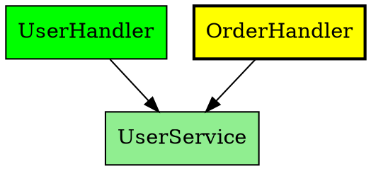

# Phase 2D: Reports & Polish

**Status**: Not Started
**Prerequisite**: Phase 2C complete
**Target**: Comprehensive reporting and migration planning tools
**Features**: 12-13 (Full Migration Report, Dependency Migration Graph)

---

## Overview

Phase 2D brings together all analysis capabilities into comprehensive reports useful for migration planning. This phase also includes polish and refinement based on learnings from earlier phases.

**Success Criteria**:
- Generate complete migration planning documents
- Provide optimal migration ordering based on dependencies
- All features production-ready and well-documented

---

## Feature 12: Full Migration Report

### 12.1 Data Models

#### Server Models (`server/core/src/main/kotlin/codelens/core/model/ratpack/ReportModels.kt`)

```kotlin
package codelens.core.model.ratpack

import kotlinx.serialization.Serializable

/**
 * Complete migration report for a Ratpack project.
 */
@Serializable
data class MigrationReport(
    /** Report metadata */
    val metadata: ReportMetadata,
    /** Executive summary */
    val executiveSummary: ExecutiveSummary,
    /** Handler inventory with complexity */
    val handlerInventory: HandlerInventory,
    /** Promise usage analysis */
    val promiseAnalysis: PromiseAnalysis,
    /** Dependency injection overview */
    val diOverview: DIOverview,
    /** External integrations */
    val externalIntegrations: ExternalIntegrations,
    /** Anti-patterns summary */
    val antiPatterns: AntiPatternReportSection,
    /** API versioning summary */
    val apiVersioning: ApiVersioningReportSection,
    /** Route structure */
    val routeStructure: RouteReportSection,
    /** Recommended migration order */
    val migrationOrder: MigrationOrderSection,
    /** Migration tips by complexity */
    val migrationTips: MigrationTipsSection
)

@Serializable
data class ReportMetadata(
    /** Report generation timestamp */
    val generatedAt: String,
    /** CodeLens version */
    val toolVersion: String,
    /** Project name */
    val projectName: String,
    /** Project path */
    val projectPath: String,
    /** Target framework for migration */
    val targetFramework: TargetFramework,
    /** Report format version */
    val reportVersion: String = "1.0"
)

@Serializable
data class ExecutiveSummary(
    /** Total handlers to migrate */
    val totalHandlers: Int,
    /** Total estimated hours */
    val estimatedHours: Double,
    /** Estimated team-weeks (assuming 30 productive hours/week) */
    val estimatedTeamWeeks: Double,
    /** Complexity distribution */
    val complexityDistribution: Map<MigrationEffort, Int>,
    /** Key risks */
    val keyRisks: List<String>,
    /** Key recommendations */
    val keyRecommendations: List<String>,
    /** Overall readiness score (0-100) */
    val readinessScore: Int,
    /** Quick wins count (TRIVIAL + LOW complexity) */
    val quickWinsCount: Int,
    /** High effort count (HIGH + VERY_HIGH complexity) */
    val highEffortCount: Int
)

@Serializable
data class HandlerInventory(
    /** All handlers with their complexity */
    val handlers: List<HandlerDetail>,
    /** Total count */
    val totalCount: Int,
    /** By complexity level */
    val byComplexity: Map<MigrationEffort, List<HandlerSummary>>
)

@Serializable
data class HandlerDetail(
    /** Handler class FQN */
    val fqn: String,
    /** Simple name */
    val simpleName: String,
    /** Package */
    val packageName: String,
    /** Complexity level */
    val complexity: MigrationEffort,
    /** Estimated hours to migrate */
    val estimatedHours: Double,
    /** Detected patterns */
    val patterns: List<String>,
    /** Dependencies count */
    val dependencyCount: Int,
    /** Dependents count (classes that use this) */
    val dependentCount: Int,
    /** Migration notes */
    val notes: List<String>,
    /** Routes served by this handler */
    val routes: List<String>,
    /** API version (if versioned) */
    val apiVersion: String?
)

@Serializable
data class HandlerSummary(
    val fqn: String,
    val simpleName: String,
    val estimatedHours: Double
)

@Serializable
data class PromiseAnalysis(
    /** Total classes using Promises */
    val classesUsingPromises: Int,
    /** Promise usage patterns */
    val usagePatterns: List<PromiseUsagePattern>,
    /** Recommendation for Promise migration */
    val recommendation: String
)

@Serializable
data class PromiseUsagePattern(
    /** Pattern name */
    val pattern: String,
    /** Count of occurrences */
    val count: Int,
    /** Example class */
    val exampleClass: String?,
    /** Migration approach */
    val migrationApproach: String
)

@Serializable
data class DIOverview(
    /** Guice modules found */
    val guiceModules: List<String>,
    /** Classes using @Inject */
    val classesWithInject: Int,
    /** Registry lookups detected */
    val registryLookups: Int,
    /** Migration recommendation */
    val recommendation: String
)

@Serializable
data class ExternalIntegrations(
    /** Database integrations */
    val databases: List<IntegrationDetail>,
    /** HTTP client usage */
    val httpClients: List<IntegrationDetail>,
    /** Message queues */
    val messageQueues: List<IntegrationDetail>,
    /** Cache systems */
    val caches: List<IntegrationDetail>,
    /** Other external systems */
    val other: List<IntegrationDetail>
)

@Serializable
data class IntegrationDetail(
    /** Integration type/name */
    val name: String,
    /** Classes using this integration */
    val usedBy: List<String>,
    /** Count of usages */
    val usageCount: Int,
    /** Migration notes */
    val migrationNotes: String
)

@Serializable
data class AntiPatternReportSection(
    /** Total anti-patterns found */
    val totalCount: Int,
    /** Critical issues */
    val criticalCount: Int,
    /** Summary by type */
    val byType: Map<String, Int>,
    /** Top issues to fix first */
    val topIssues: List<AntiPatternReportItem>
)

@Serializable
data class AntiPatternReportItem(
    val type: String,
    val severity: String,
    val classFqn: String,
    val recommendation: String
)

@Serializable
data class ApiVersioningReportSection(
    /** Detected strategy */
    val strategy: String,
    /** Versions found */
    val versions: List<String>,
    /** Handlers per version */
    val handlersPerVersion: Map<String, Int>,
    /** Migration consideration */
    val migrationConsideration: String
)

@Serializable
data class RouteReportSection(
    /** Total routes */
    val totalRoutes: Int,
    /** Routes by method */
    val byMethod: Map<String, Int>,
    /** Route groups (prefixes) */
    val routeGroups: List<RouteGroupSummary>
)

@Serializable
data class RouteGroupSummary(
    /** Prefix path */
    val prefix: String,
    /** Route count */
    val routeCount: Int,
    /** Handlers involved */
    val handlers: List<String>
)

@Serializable
data class MigrationOrderSection(
    /** Recommended order */
    val recommendedOrder: List<MigrationPhase>,
    /** Total phases */
    val totalPhases: Int,
    /** Rationale */
    val rationale: String
)

@Serializable
data class MigrationPhase(
    /** Phase number (1-based) */
    val phase: Int,
    /** Phase name */
    val name: String,
    /** Handlers in this phase */
    val handlers: List<String>,
    /** Estimated hours for this phase */
    val estimatedHours: Double,
    /** Why these handlers are in this phase */
    val rationale: String,
    /** Dependencies from previous phases */
    val dependencies: List<String>
)

@Serializable
data class MigrationTipsSection(
    /** Tips organized by complexity level */
    val tipsByComplexity: Map<MigrationEffort, List<MigrationTip>>
)

@Serializable
data class MigrationTip(
    /** Tip title */
    val title: String,
    /** Detailed description */
    val description: String,
    /** Applicable patterns */
    val applicablePatterns: List<String>,
    /** Code example */
    val example: String?
)
```

### 12.2 Report Generator

#### MigrationReportGenerator (`server/classgraph/src/main/kotlin/codelens/classgraph/ratpack/MigrationReportGenerator.kt`)

```kotlin
package codelens.classgraph.ratpack

import codelens.core.model.ClassInfo
import codelens.core.model.ClassSource
import codelens.core.model.ratpack.*
import java.time.Instant

/**
 * Generates comprehensive migration reports by aggregating all analysis results.
 */
class MigrationReportGenerator(
    private val classes: Map<String, ClassInfo>,
    private val projectName: String,
    private val projectPath: String,
    private val toolVersion: String
) {
    private val hintGenerator = MigrationHintGenerator(classes)
    private val antiPatternDetector = AntiPatternDetector(classes)
    private val apiVersionDetector = ApiVersionDetector(classes)
    private val routeAnalyzer = RouteAnalyzer(classes)

    /**
     * Generate a complete migration report.
     */
    fun generate(targetFramework: TargetFramework = TargetFramework.KOTLIN_SPRING): MigrationReport {
        // Gather all handlers
        val handlers = findAllHandlers()

        // Analyze each handler
        val handlerDetails = handlers.mapNotNull { handler ->
            analyzeHandler(handler, targetFramework)
        }

        // Get other analysis results
        val antiPatternSummary = antiPatternDetector.analyze()
        val apiVersioningSummary = apiVersionDetector.analyze()
        val routingSummary = routeAnalyzer.analyze()

        // Build report sections
        val executiveSummary = buildExecutiveSummary(handlerDetails, antiPatternSummary)
        val handlerInventory = buildHandlerInventory(handlerDetails)
        val promiseAnalysis = analyzePromiseUsage()
        val diOverview = analyzeDI()
        val externalIntegrations = analyzeExternalIntegrations()
        val antiPatternSection = buildAntiPatternSection(antiPatternSummary)
        val apiVersioningSection = buildApiVersioningSection(apiVersioningSummary)
        val routeSection = buildRouteSection(routingSummary)
        val migrationOrder = buildMigrationOrder(handlerDetails)
        val migrationTips = buildMigrationTips(targetFramework)

        return MigrationReport(
            metadata = ReportMetadata(
                generatedAt = Instant.now().toString(),
                toolVersion = toolVersion,
                projectName = projectName,
                projectPath = projectPath,
                targetFramework = targetFramework
            ),
            executiveSummary = executiveSummary,
            handlerInventory = handlerInventory,
            promiseAnalysis = promiseAnalysis,
            diOverview = diOverview,
            externalIntegrations = externalIntegrations,
            antiPatterns = antiPatternSection,
            apiVersioning = apiVersioningSection,
            routeStructure = routeSection,
            migrationOrder = migrationOrder,
            migrationTips = migrationTips
        )
    }

    private fun findAllHandlers(): List<ClassInfo> {
        return classes.values.filter { classInfo ->
            classInfo.source == ClassSource.PROJECT &&
            (classInfo.interfaces.contains("ratpack.handling.Handler") ||
             hasTransitiveInterface(classInfo, "ratpack.handling.Handler"))
        }
    }

    private fun analyzeHandler(handler: ClassInfo, targetFramework: TargetFramework): HandlerDetail? {
        val hints = hintGenerator.analyzeClass(handler.name.fqn, listOf(targetFramework)) ?: return null

        // Get routes for this handler
        val routingSummary = routeAnalyzer.analyze()
        val routes = routingSummary.routesByHandler[handler.name.fqn]?.map { it.path } ?: emptyList()

        // Get API version
        val apiVersioning = apiVersionDetector.analyze()
        val version = apiVersioning.handlersByVersion.entries
            .find { it.value.any { h -> h.handlerFqn == handler.name.fqn } }
            ?.key

        // Count dependencies
        val dependencyAnalyzer = DependencyAnalyzer(classes)
        val (outgoing, incoming) = dependencyAnalyzer.analyze(handler.name.fqn, false)

        return HandlerDetail(
            fqn = handler.name.fqn,
            simpleName = handler.name.simpleName,
            packageName = handler.name.packageName,
            complexity = hints.overallEffort,
            estimatedHours = hints.estimatedHours,
            patterns = hints.detectedPatterns.map { it.name },
            dependencyCount = outgoing.size,
            dependentCount = incoming.size,
            notes = generateHandlerNotes(hints),
            routes = routes,
            apiVersion = version
        )
    }

    private fun generateHandlerNotes(hints: ClassMigrationHints): List<String> {
        val notes = mutableListOf<String>()

        if (hints.detectedPatterns.any { it.category == PatternCategory.BLOCKING }) {
            notes.add("Contains blocking operations - review thread safety")
        }
        if (hints.detectedPatterns.any { it.category == PatternCategory.PROMISE }) {
            notes.add("Uses Promise chains - consider coroutines or simplification")
        }
        if (hints.overallEffort >= MigrationEffort.HIGH) {
            notes.add("Complex handler - plan for thorough testing")
        }

        return notes
    }

    private fun buildExecutiveSummary(
        handlers: List<HandlerDetail>,
        antiPatterns: AntiPatternSummary
    ): ExecutiveSummary {
        val totalHours = handlers.sumOf { it.estimatedHours }
        val teamWeeks = totalHours / 30.0 // Assuming 30 productive hours per week

        val complexityDistribution = handlers.groupBy { it.complexity }
            .mapValues { it.value.size }

        val quickWins = handlers.count {
            it.complexity == MigrationEffort.TRIVIAL || it.complexity == MigrationEffort.LOW
        }
        val highEffort = handlers.count {
            it.complexity == MigrationEffort.HIGH || it.complexity == MigrationEffort.VERY_HIGH
        }

        // Calculate readiness score
        val readinessScore = calculateReadinessScore(handlers, antiPatterns)

        // Generate risks
        val risks = mutableListOf<String>()
        if (antiPatterns.totalCount > 0) {
            risks.add("${antiPatterns.totalCount} anti-patterns detected that should be fixed before migration")
        }
        if (highEffort > handlers.size / 3) {
            risks.add("High proportion of complex handlers may slow migration")
        }
        if (handlers.any { it.dependentCount > 10 }) {
            risks.add("Some handlers have many dependents - changes will have wide impact")
        }

        // Generate recommendations
        val recommendations = mutableListOf<String>()
        if (quickWins > 0) {
            recommendations.add("Start with $quickWins quick-win handlers to build momentum")
        }
        if (antiPatterns.criticalCount > 0) {
            recommendations.add("Fix ${antiPatterns.criticalCount} critical anti-patterns before starting migration")
        }
        recommendations.add("Set up parallel testing infrastructure early")
        recommendations.add("Consider feature flags for gradual rollout")

        return ExecutiveSummary(
            totalHandlers = handlers.size,
            estimatedHours = totalHours,
            estimatedTeamWeeks = teamWeeks,
            complexityDistribution = complexityDistribution,
            keyRisks = risks,
            keyRecommendations = recommendations,
            readinessScore = readinessScore,
            quickWinsCount = quickWins,
            highEffortCount = highEffort
        )
    }

    private fun calculateReadinessScore(
        handlers: List<HandlerDetail>,
        antiPatterns: AntiPatternSummary
    ): Int {
        var score = 100

        // Deduct for anti-patterns
        score -= antiPatterns.criticalCount * 10
        score -= antiPatterns.instances.count { it.severity == AntiPatternSeverity.ERROR } * 5
        score -= antiPatterns.instances.count { it.severity == AntiPatternSeverity.WARNING } * 2

        // Deduct for high complexity
        val highComplexityRatio = handlers.count {
            it.complexity >= MigrationEffort.HIGH
        }.toDouble() / handlers.size.coerceAtLeast(1)
        score -= (highComplexityRatio * 20).toInt()

        // Deduct for high coupling
        val avgDependents = handlers.map { it.dependentCount }.average()
        if (avgDependents > 5) score -= 10

        return score.coerceIn(0, 100)
    }

    private fun buildHandlerInventory(handlers: List<HandlerDetail>): HandlerInventory {
        val byComplexity = handlers.groupBy { it.complexity }
            .mapValues { entry ->
                entry.value.map { HandlerSummary(it.fqn, it.simpleName, it.estimatedHours) }
            }

        return HandlerInventory(
            handlers = handlers.sortedBy { it.complexity.ordinal * 1000 - it.estimatedHours.toInt() },
            totalCount = handlers.size,
            byComplexity = byComplexity
        )
    }

    private fun analyzePromiseUsage(): PromiseAnalysis {
        val promiseClasses = classes.values.filter { classInfo ->
            classInfo.source == ClassSource.PROJECT &&
            (classInfo.methods.any { it.returnType.contains("Promise") } ||
             classInfo.fields.any { it.type.contains("Promise") })
        }

        val patterns = mutableListOf<PromiseUsagePattern>()

        // Count flatMap usage
        val flatMapUsers = promiseClasses.filter { classInfo ->
            classInfo.methods.any { it.name == "flatMap" || it.returnType.contains("flatMap") }
        }
        if (flatMapUsers.isNotEmpty()) {
            patterns.add(PromiseUsagePattern(
                pattern = "Promise.flatMap() composition",
                count = flatMapUsers.size,
                exampleClass = flatMapUsers.firstOrNull()?.name?.fqn,
                migrationApproach = "Convert to sequential suspend calls or Mono.flatMap()"
            ))
        }

        // Count map usage
        val mapUsers = promiseClasses.filter { classInfo ->
            classInfo.methods.any { it.name == "map" }
        }
        if (mapUsers.isNotEmpty()) {
            patterns.add(PromiseUsagePattern(
                pattern = "Promise.map() transformation",
                count = mapUsers.size,
                exampleClass = mapUsers.firstOrNull()?.name?.fqn,
                migrationApproach = "Direct method calls or Mono.map()"
            ))
        }

        val recommendation = when {
            promiseClasses.isEmpty() -> "No Promise usage detected - migration will be straightforward"
            flatMapUsers.size > promiseClasses.size / 2 -> "Heavy Promise composition usage - consider Kotlin coroutines for cleaner code"
            else -> "Moderate Promise usage - can migrate to either synchronous or reactive patterns"
        }

        return PromiseAnalysis(
            classesUsingPromises = promiseClasses.size,
            usagePatterns = patterns,
            recommendation = recommendation
        )
    }

    private fun analyzeDI(): DIOverview {
        // Find Guice modules
        val guiceModules = classes.values.filter { classInfo ->
            classInfo.source == ClassSource.PROJECT &&
            classInfo.superclass?.contains("AbstractModule") == true
        }.map { it.name.fqn }

        // Find @Inject usage
        val injectClasses = classes.values.count { classInfo ->
            classInfo.source == ClassSource.PROJECT &&
            (classInfo.annotations.any { it.type.contains("Inject") } ||
             classInfo.fields.any { f -> f.annotations.any { it.type.contains("Inject") } } ||
             classInfo.methods.any { m -> m.annotations.any { it.type.contains("Inject") } })
        }

        // Estimate Registry lookups (heuristic)
        val registryLookups = classes.values.count { classInfo ->
            classInfo.source == ClassSource.PROJECT &&
            classInfo.methods.any { m ->
                m.parameters.any { it.type.contains("Context") || it.type.contains("Registry") }
            }
        }

        val recommendation = when {
            guiceModules.isEmpty() && injectClasses == 0 -> "No DI framework detected - use Spring's constructor injection"
            guiceModules.isNotEmpty() -> "Guice modules found - create equivalent Spring @Configuration classes"
            else -> "Convert @Inject annotations to Spring's constructor injection pattern"
        }

        return DIOverview(
            guiceModules = guiceModules,
            classesWithInject = injectClasses,
            registryLookups = registryLookups,
            recommendation = recommendation
        )
    }

    private fun analyzeExternalIntegrations(): ExternalIntegrations {
        val databases = mutableListOf<IntegrationDetail>()
        val httpClients = mutableListOf<IntegrationDetail>()
        val messageQueues = mutableListOf<IntegrationDetail>()
        val caches = mutableListOf<IntegrationDetail>()
        val other = mutableListOf<IntegrationDetail>()

        // Database detection
        val jdbcUsers = findClassesUsing(listOf("java.sql.", "javax.sql.", "DataSource"))
        if (jdbcUsers.isNotEmpty()) {
            databases.add(IntegrationDetail(
                name = "JDBC",
                usedBy = jdbcUsers.map { it.name.simpleName },
                usageCount = jdbcUsers.size,
                migrationNotes = "Use Spring's JdbcTemplate or Spring Data JPA"
            ))
        }

        val hibernateUsers = findClassesUsing(listOf("org.hibernate.", "EntityManager"))
        if (hibernateUsers.isNotEmpty()) {
            databases.add(IntegrationDetail(
                name = "Hibernate/JPA",
                usedBy = hibernateUsers.map { it.name.simpleName },
                usageCount = hibernateUsers.size,
                migrationNotes = "Direct migration to Spring Data JPA"
            ))
        }

        // HTTP client detection
        val httpClientUsers = findClassesUsing(listOf("HttpClient", "HttpURLConnection", "OkHttp", "RestTemplate"))
        if (httpClientUsers.isNotEmpty()) {
            httpClients.add(IntegrationDetail(
                name = "HTTP Client",
                usedBy = httpClientUsers.map { it.name.simpleName },
                usageCount = httpClientUsers.size,
                migrationNotes = "Use WebClient for reactive or RestTemplate for blocking"
            ))
        }

        // Message queue detection
        val kafkaUsers = findClassesUsing(listOf("kafka", "KafkaProducer", "KafkaConsumer"))
        if (kafkaUsers.isNotEmpty()) {
            messageQueues.add(IntegrationDetail(
                name = "Kafka",
                usedBy = kafkaUsers.map { it.name.simpleName },
                usageCount = kafkaUsers.size,
                migrationNotes = "Use Spring Kafka"
            ))
        }

        val rabbitUsers = findClassesUsing(listOf("rabbit", "amqp", "RabbitTemplate"))
        if (rabbitUsers.isNotEmpty()) {
            messageQueues.add(IntegrationDetail(
                name = "RabbitMQ",
                usedBy = rabbitUsers.map { it.name.simpleName },
                usageCount = rabbitUsers.size,
                migrationNotes = "Use Spring AMQP"
            ))
        }

        // Cache detection
        val redisUsers = findClassesUsing(listOf("redis", "jedis", "lettuce"))
        if (redisUsers.isNotEmpty()) {
            caches.add(IntegrationDetail(
                name = "Redis",
                usedBy = redisUsers.map { it.name.simpleName },
                usageCount = redisUsers.size,
                migrationNotes = "Use Spring Data Redis"
            ))
        }

        return ExternalIntegrations(
            databases = databases,
            httpClients = httpClients,
            messageQueues = messageQueues,
            caches = caches,
            other = other
        )
    }

    private fun findClassesUsing(patterns: List<String>): List<ClassInfo> {
        return classes.values.filter { classInfo ->
            classInfo.source == ClassSource.PROJECT &&
            (classInfo.fields.any { f -> patterns.any { p -> f.type.contains(p, ignoreCase = true) } } ||
             classInfo.methods.any { m ->
                 m.returnType.contains(patterns.any { p -> m.returnType.contains(p, ignoreCase = true) }.toString()) ||
                 m.parameters.any { param -> patterns.any { p -> param.type.contains(p, ignoreCase = true) } }
             })
        }
    }

    private fun buildAntiPatternSection(summary: AntiPatternSummary): AntiPatternReportSection {
        val topIssues = summary.instances
            .sortedByDescending {
                when (it.severity) {
                    AntiPatternSeverity.CRITICAL -> 4
                    AntiPatternSeverity.ERROR -> 3
                    AntiPatternSeverity.WARNING -> 2
                    AntiPatternSeverity.INFO -> 1
                }
            }
            .take(10)
            .map {
                AntiPatternReportItem(
                    type = it.type.name,
                    severity = it.severity.name,
                    classFqn = it.classFqn,
                    recommendation = it.recommendation
                )
            }

        return AntiPatternReportSection(
            totalCount = summary.totalCount,
            criticalCount = summary.countBySeverity[AntiPatternSeverity.CRITICAL] ?: 0,
            byType = summary.countByType.mapKeys { it.key.name },
            topIssues = topIssues
        )
    }

    private fun buildApiVersioningSection(summary: ApiVersioningSummary): ApiVersioningReportSection {
        val consideration = when (summary.primaryStrategy) {
            VersioningStrategy.NONE -> "No versioning detected - consider adding versioning strategy in Spring"
            VersioningStrategy.PATH_BASED -> "Path-based versioning maps directly to Spring @RequestMapping paths"
            VersioningStrategy.HEADER_BASED -> "Header-based versioning requires custom RequestCondition in Spring"
            VersioningStrategy.CLASS_SUFFIX -> "Class suffix versioning - consolidate into versioned controllers"
            else -> "Mixed versioning strategies - standardize on one approach"
        }

        return ApiVersioningReportSection(
            strategy = summary.primaryStrategy.name,
            versions = summary.versions.map { it.version },
            handlersPerVersion = summary.handlersByVersion.mapValues { it.value.size },
            migrationConsideration = consideration
        )
    }

    private fun buildRouteSection(summary: RoutingSummary): RouteReportSection {
        // Group routes by first path segment
        val routeGroups = summary.routes
            .groupBy { route ->
                val segments = route.path.trim('/').split("/")
                if (segments.isNotEmpty()) "/${segments[0]}" else "/"
            }
            .map { (prefix, routes) ->
                RouteGroupSummary(
                    prefix = prefix,
                    routeCount = routes.size,
                    handlers = routes.mapNotNull { it.handlerSimpleName }.distinct()
                )
            }
            .sortedByDescending { it.routeCount }

        return RouteReportSection(
            totalRoutes = summary.totalRoutes,
            byMethod = summary.routesByMethod.mapKeys { it.key.name },
            routeGroups = routeGroups
        )
    }

    private fun buildMigrationOrder(handlers: List<HandlerDetail>): MigrationOrderSection {
        // Build dependency graph
        val graphBuilder = MigrationGraphBuilder(classes)
        val graph = graphBuilder.buildGraph(handlers.map { it.fqn })

        // Get topologically sorted order
        val sortedHandlers = graphBuilder.topologicalSort(graph)

        // Group into phases
        val phases = mutableListOf<MigrationPhase>()
        var currentPhase = mutableListOf<String>()
        var phaseNumber = 1
        val completedHandlers = mutableSetOf<String>()

        for (handlerFqn in sortedHandlers) {
            val handlerDetail = handlers.find { it.fqn == handlerFqn } ?: continue
            val dependencies = graph.edges[handlerFqn] ?: emptySet()

            // Check if all dependencies are completed
            if (dependencies.all { it in completedHandlers }) {
                // Can add to current phase if not too big
                if (currentPhase.size < 5) {
                    currentPhase.add(handlerFqn)
                } else {
                    // Finalize current phase and start new one
                    phases.add(createPhase(phaseNumber, currentPhase, handlers, completedHandlers))
                    completedHandlers.addAll(currentPhase)
                    phaseNumber++
                    currentPhase = mutableListOf(handlerFqn)
                }
            } else {
                // Start new phase
                if (currentPhase.isNotEmpty()) {
                    phases.add(createPhase(phaseNumber, currentPhase, handlers, completedHandlers))
                    completedHandlers.addAll(currentPhase)
                    phaseNumber++
                }
                currentPhase = mutableListOf(handlerFqn)
            }
        }

        // Add final phase
        if (currentPhase.isNotEmpty()) {
            phases.add(createPhase(phaseNumber, currentPhase, handlers, completedHandlers))
        }

        return MigrationOrderSection(
            recommendedOrder = phases,
            totalPhases = phases.size,
            rationale = "Order based on dependency analysis - migrate dependencies before dependents"
        )
    }

    private fun createPhase(
        number: Int,
        handlerFqns: List<String>,
        allHandlers: List<HandlerDetail>,
        completedHandlers: Set<String>
    ): MigrationPhase {
        val handlersInPhase = handlerFqns.mapNotNull { fqn ->
            allHandlers.find { it.fqn == fqn }
        }

        val totalHours = handlersInPhase.sumOf { it.estimatedHours }

        val dependencies = handlersInPhase
            .flatMap { handler ->
                allHandlers.filter { it.fqn in completedHandlers }
                    .filter { completed ->
                        // Check if handler depends on completed
                        handler.dependencyCount > 0  // Simplified check
                    }
                    .map { it.simpleName }
            }
            .distinct()

        val name = when (number) {
            1 -> "Foundation - Independent Handlers"
            2 -> "Core Services"
            3 -> "Business Logic"
            else -> "Phase $number"
        }

        return MigrationPhase(
            phase = number,
            name = name,
            handlers = handlerFqns.mapNotNull { fqn ->
                allHandlers.find { it.fqn == fqn }?.simpleName
            },
            estimatedHours = totalHours,
            rationale = "These handlers ${if (number == 1) "have no dependencies" else "depend on handlers from previous phases"}",
            dependencies = dependencies
        )
    }

    private fun buildMigrationTips(targetFramework: TargetFramework): MigrationTipsSection {
        val tips = mutableMapOf<MigrationEffort, List<MigrationTip>>()

        tips[MigrationEffort.TRIVIAL] = listOf(
            MigrationTip(
                title = "Direct Handler Conversion",
                description = "Simple handlers with ctx.render() map directly to @RestController methods",
                applicablePatterns = listOf("SIMPLE_HANDLER"),
                example = """
                    // Ratpack
                    ctx.render(Jackson.json(data))

                    // Spring
                    return data  // Jackson handles serialization
                """.trimIndent()
            )
        )

        tips[MigrationEffort.LOW] = listOf(
            MigrationTip(
                title = "Remove Blocking.get() Wrappers",
                description = "Spring MVC is blocking by default - remove Blocking.get() wrappers",
                applicablePatterns = listOf("BLOCKING_GET_HANDLER"),
                example = null
            ),
            MigrationTip(
                title = "Convert Path Tokens",
                description = "Replace ctx.pathTokens['id'] with @PathVariable annotations",
                applicablePatterns = listOf("CHAIN_PATH_BINDING"),
                example = null
            )
        )

        tips[MigrationEffort.MEDIUM] = listOf(
            MigrationTip(
                title = "Promise Chain Migration",
                description = "Convert Promise.flatMap() chains to sequential code or Kotlin coroutines",
                applicablePatterns = listOf("PROMISE_CHAIN_HANDLER", "PROMISE_FLATMAP"),
                example = """
                    // Ratpack Promise chain
                    userService.find(id)
                        .flatMap { user -> orderService.findForUser(user.id) }
                        .then { orders -> ctx.render(orders) }

                    // Kotlin coroutine
                    suspend fun getOrders(id: String): List<Order> {
                        val user = userService.find(id)
                        return orderService.findForUser(user.id)
                    }
                """.trimIndent()
            )
        )

        tips[MigrationEffort.HIGH] = listOf(
            MigrationTip(
                title = "Complex Error Handling",
                description = "Custom error handlers become @ControllerAdvice with @ExceptionHandler",
                applicablePatterns = listOf("ERROR_HANDLER"),
                example = null
            )
        )

        tips[MigrationEffort.VERY_HIGH] = listOf(
            MigrationTip(
                title = "Architecture Review Required",
                description = "Handlers with very high complexity may need architectural redesign",
                applicablePatterns = emptyList(),
                example = null
            )
        )

        return MigrationTipsSection(tipsByComplexity = tips)
    }

    private fun hasTransitiveInterface(classInfo: ClassInfo, interfaceFqn: String): Boolean {
        if (classInfo.interfaces.contains(interfaceFqn)) return true

        for (iface in classInfo.interfaces) {
            classes[iface]?.let { ifaceInfo ->
                if (hasTransitiveInterface(ifaceInfo, interfaceFqn)) return true
            }
        }

        classInfo.superclass?.let { superFqn ->
            classes[superFqn]?.let { superInfo ->
                if (hasTransitiveInterface(superInfo, interfaceFqn)) return true
            }
        }

        return false
    }
}
```

### 12.3 Markdown Report Formatter

#### MarkdownReportFormatter (`server/classgraph/src/main/kotlin/codelens/classgraph/ratpack/MarkdownReportFormatter.kt`)

```kotlin
package codelens.classgraph.ratpack

import codelens.core.model.ratpack.*

/**
 * Formats a MigrationReport as Markdown.
 */
object MarkdownReportFormatter {

    fun format(report: MigrationReport): String = buildString {
        appendLine("# Migration Report: ${report.metadata.projectName}")
        appendLine()
        appendLine("**Generated:** ${report.metadata.generatedAt}")
        appendLine("**Target Framework:** ${report.metadata.targetFramework}")
        appendLine("**CodeLens Version:** ${report.metadata.toolVersion}")
        appendLine()

        // Executive Summary
        appendLine("## Executive Summary")
        appendLine()
        with(report.executiveSummary) {
            appendLine("| Metric | Value |")
            appendLine("|--------|-------|")
            appendLine("| Total Handlers | $totalHandlers |")
            appendLine("| Estimated Hours | ${String.format("%.1f", estimatedHours)} |")
            appendLine("| Estimated Team-Weeks | ${String.format("%.1f", estimatedTeamWeeks)} |")
            appendLine("| Readiness Score | $readinessScore/100 |")
            appendLine("| Quick Wins | $quickWinsCount |")
            appendLine("| High Effort | $highEffortCount |")
            appendLine()

            appendLine("### Complexity Distribution")
            appendLine()
            appendLine("| Complexity | Count |")
            appendLine("|------------|-------|")
            complexityDistribution.forEach { (level, count) ->
                appendLine("| $level | $count |")
            }
            appendLine()

            if (keyRisks.isNotEmpty()) {
                appendLine("### Key Risks")
                appendLine()
                keyRisks.forEach { appendLine("- $it") }
                appendLine()
            }

            if (keyRecommendations.isNotEmpty()) {
                appendLine("### Recommendations")
                appendLine()
                keyRecommendations.forEach { appendLine("- $it") }
                appendLine()
            }
        }

        // Handler Inventory
        appendLine("## Handler Inventory")
        appendLine()
        appendLine("### By Complexity")
        appendLine()

        report.handlerInventory.byComplexity.forEach { (complexity, handlers) ->
            appendLine("#### $complexity (${handlers.size} handlers)")
            appendLine()
            if (handlers.isNotEmpty()) {
                appendLine("| Handler | Est. Hours |")
                appendLine("|---------|------------|")
                handlers.forEach { handler ->
                    appendLine("| ${handler.simpleName} | ${String.format("%.1f", handler.estimatedHours)} |")
                }
                appendLine()
            }
        }

        // Anti-Patterns
        appendLine("## Anti-Patterns")
        appendLine()
        with(report.antiPatterns) {
            appendLine("**Total Issues:** $totalCount")
            appendLine("**Critical:** $criticalCount")
            appendLine()

            if (topIssues.isNotEmpty()) {
                appendLine("### Top Issues")
                appendLine()
                appendLine("| Severity | Type | Class | Recommendation |")
                appendLine("|----------|------|-------|----------------|")
                topIssues.forEach { issue ->
                    appendLine("| ${issue.severity} | ${issue.type} | ${issue.classFqn.substringAfterLast(".")} | ${issue.recommendation} |")
                }
                appendLine()
            }
        }

        // Migration Order
        appendLine("## Recommended Migration Order")
        appendLine()
        appendLine(report.migrationOrder.rationale)
        appendLine()

        report.migrationOrder.recommendedOrder.forEach { phase ->
            appendLine("### Phase ${phase.phase}: ${phase.name}")
            appendLine()
            appendLine("**Estimated Hours:** ${String.format("%.1f", phase.estimatedHours)}")
            appendLine()
            appendLine("**Handlers:**")
            phase.handlers.forEach { handler ->
                appendLine("- $handler")
            }
            appendLine()
            if (phase.dependencies.isNotEmpty()) {
                appendLine("**Depends on:** ${phase.dependencies.joinToString(", ")}")
                appendLine()
            }
        }

        // Migration Tips
        appendLine("## Migration Tips")
        appendLine()
        report.migrationTips.tipsByComplexity.forEach { (complexity, tips) ->
            appendLine("### $complexity Complexity")
            appendLine()
            tips.forEach { tip ->
                appendLine("#### ${tip.title}")
                appendLine()
                appendLine(tip.description)
                appendLine()
                tip.example?.let { example ->
                    appendLine("```kotlin")
                    appendLine(example)
                    appendLine("```")
                    appendLine()
                }
            }
        }

        // External Integrations
        appendLine("## External Integrations")
        appendLine()
        with(report.externalIntegrations) {
            if (databases.isNotEmpty()) {
                appendLine("### Databases")
                databases.forEach { db ->
                    appendLine("- **${db.name}** (${db.usageCount} usages): ${db.migrationNotes}")
                }
                appendLine()
            }
            if (httpClients.isNotEmpty()) {
                appendLine("### HTTP Clients")
                httpClients.forEach { client ->
                    appendLine("- **${client.name}** (${client.usageCount} usages): ${client.migrationNotes}")
                }
                appendLine()
            }
            if (messageQueues.isNotEmpty()) {
                appendLine("### Message Queues")
                messageQueues.forEach { mq ->
                    appendLine("- **${mq.name}** (${mq.usageCount} usages): ${mq.migrationNotes}")
                }
                appendLine()
            }
            if (caches.isNotEmpty()) {
                appendLine("### Caches")
                caches.forEach { cache ->
                    appendLine("- **${cache.name}** (${cache.usageCount} usages): ${cache.migrationNotes}")
                }
                appendLine()
            }
        }

        // Footer
        appendLine("---")
        appendLine()
        appendLine("*Report generated by CodeLens ${report.metadata.toolVersion}*")
    }
}
```

### 12.4 API Endpoints

```kotlin
/**
 * GET /api/v1/ratpack/report
 * Generate a full migration report.
 *
 * Query parameters:
 * - target: Target framework (default: KOTLIN_SPRING)
 * - format: Output format (json, markdown) - default: json
 */
get("/ratpack/report") {
    val target = call.request.queryParameters["target"]
        ?.let { TargetFramework.valueOf(it.uppercase()) }
        ?: TargetFramework.KOTLIN_SPRING
    val format = call.request.queryParameters["format"]?.lowercase() ?: "json"

    val report = analysisService.generateMigrationReport(target)

    when (format) {
        "markdown", "md" -> {
            val markdown = MarkdownReportFormatter.format(report)
            call.respondText(markdown, ContentType.Text.Plain)
        }
        else -> {
            call.respond(MigrationReportResponse(report = report))
        }
    }
}

/**
 * GET /api/v1/ratpack/report/summary
 * Get just the executive summary.
 */
get("/ratpack/report/summary") {
    val target = call.request.queryParameters["target"]
        ?.let { TargetFramework.valueOf(it.uppercase()) }
        ?: TargetFramework.KOTLIN_SPRING

    val report = analysisService.generateMigrationReport(target)
    call.respond(ExecutiveSummaryResponse(summary = report.executiveSummary))
}
```

### 12.5 CLI Implementation

#### Commands (`cli/src/codelens_cli/commands/report.py`)

```python
"""Migration report commands."""

import sys
from pathlib import Path
from typing import Optional

import typer

from codelens_cli.commands.common import ensure_server_running, get_client, handle_api_errors
from codelens_cli.output import is_tty, print_json

app = typer.Typer(
    name="report",
    help="Generate migration reports.",
    no_args_is_help=True,
)


@app.command(name="generate")
def generate_report(
    project: Optional[str] = typer.Option(
        None, "--project", "-p", help="Project directory"
    ),
    target: str = typer.Option(
        "KOTLIN_SPRING", "--target", "-t", help="Target framework (KOTLIN_SPRING, JAVA_SPRING, etc.)"
    ),
    format: str = typer.Option(
        "markdown", "--format", "-f", help="Output format (markdown, json)"
    ),
    output: Optional[str] = typer.Option(
        None, "--output", "-o", help="Output file path (default: stdout)"
    ),
) -> None:
    """Generate a full migration report."""
    # Don't suppress JSON output for reports - they need the data
    server, project_path = ensure_server_running(project, json_output=False)
    client = get_client(server)

    with handle_api_errors():
        result = client.get_migration_report(target=target, format=format)

        if format.lower() in ("markdown", "md"):
            content = result if isinstance(result, str) else result.get("markdown", "")
            if output:
                Path(output).write_text(content)
                typer.echo(f"Report written to {output}")
            else:
                typer.echo(content)
        else:
            if output:
                import json
                Path(output).write_text(json.dumps(result, indent=2))
                typer.echo(f"Report written to {output}")
            else:
                print_json(result)


@app.command(name="summary")
def show_summary(
    project: Optional[str] = typer.Option(
        None, "--project", "-p", help="Project directory"
    ),
    target: str = typer.Option(
        "KOTLIN_SPRING", "--target", "-t", help="Target framework"
    ),
    json_output: bool = typer.Option(False, "--json", help="Output as JSON"),
) -> None:
    """Show executive summary only."""
    server, project_path = ensure_server_running(project, json_output)
    client = get_client(server)

    with handle_api_errors():
        result = client.get_report_summary(target=target)

        if json_output or not is_tty():
            print_json(result)
        else:
            _print_summary(result)


def _print_summary(result: dict) -> None:
    """Print executive summary in a nice format."""
    from rich.console import Console
    from rich.table import Table
    from rich.panel import Panel
    from rich.progress import Progress, BarColumn, TextColumn

    console = Console()
    summary = result.get("summary", {})

    console.print("\n[bold]Migration Report - Executive Summary[/bold]")
    console.print()

    # Key metrics
    table = Table(show_header=False, box=None, padding=(0, 2))
    table.add_column("Metric", style="dim")
    table.add_column("Value")

    table.add_row("Total Handlers:", str(summary.get("totalHandlers", 0)))
    table.add_row("Estimated Hours:", f"{summary.get('estimatedHours', 0):.1f}")
    table.add_row("Estimated Team-Weeks:", f"{summary.get('estimatedTeamWeeks', 0):.1f}")
    table.add_row("Quick Wins:", str(summary.get("quickWinsCount", 0)))
    table.add_row("High Effort:", str(summary.get("highEffortCount", 0)))

    console.print(table)
    console.print()

    # Readiness score with bar
    score = summary.get("readinessScore", 0)
    score_color = "green" if score >= 70 else "yellow" if score >= 40 else "red"
    console.print(f"[bold]Readiness Score:[/bold] [{score_color}]{score}/100[/]")
    console.print()

    # Complexity distribution
    distribution = summary.get("complexityDistribution", {})
    if distribution:
        console.print("[bold]Complexity Distribution[/bold]")
        complexity_table = Table(show_header=True, header_style="bold")
        complexity_table.add_column("Level")
        complexity_table.add_column("Count", justify="right")

        complexity_colors = {
            "TRIVIAL": "green",
            "LOW": "cyan",
            "MEDIUM": "yellow",
            "HIGH": "red",
            "VERY_HIGH": "red bold",
        }

        for level, count in distribution.items():
            color = complexity_colors.get(level, "white")
            complexity_table.add_row(f"[{color}]{level}[/]", str(count))

        console.print(complexity_table)
        console.print()

    # Risks
    risks = summary.get("keyRisks", [])
    if risks:
        console.print("[bold red]Key Risks[/bold red]")
        for risk in risks:
            console.print(f"  [red]-[/] {risk}")
        console.print()

    # Recommendations
    recommendations = summary.get("keyRecommendations", [])
    if recommendations:
        console.print("[bold green]Recommendations[/bold green]")
        for rec in recommendations:
            console.print(f"  [green]-[/] {rec}")
        console.print()
```

---

## Feature 13: Dependency Migration Graph

### 13.1 Data Models

#### Server Models (`server/core/src/main/kotlin/codelens/core/model/ratpack/GraphModels.kt`)

```kotlin
package codelens.core.model.ratpack

import kotlinx.serialization.Serializable

/**
 * A dependency graph for migration planning.
 */
@Serializable
data class MigrationGraph(
    /** All nodes (handlers/classes) */
    val nodes: List<GraphNode>,
    /** All edges (dependencies) */
    val edges: List<GraphEdge>,
    /** Detected cycles (if any) */
    val cycles: List<List<String>>,
    /** Is the graph acyclic? */
    val isAcyclic: Boolean
)

@Serializable
data class GraphNode(
    /** Class FQN */
    val id: String,
    /** Display name */
    val label: String,
    /** Node type */
    val type: GraphNodeType,
    /** Complexity level */
    val complexity: MigrationEffort?,
    /** In-degree (number of dependents) */
    val inDegree: Int,
    /** Out-degree (number of dependencies) */
    val outDegree: Int,
    /** Is this a critical path node? */
    val isCriticalPath: Boolean
)

@Serializable
enum class GraphNodeType {
    HANDLER,
    SERVICE,
    REPOSITORY,
    UTILITY,
    EXTERNAL
}

@Serializable
data class GraphEdge(
    /** Source node ID */
    val source: String,
    /** Target node ID */
    val target: String,
    /** Dependency type */
    val type: DependencyEdgeType,
    /** Edge weight (for prioritization) */
    val weight: Int
)

@Serializable
enum class DependencyEdgeType {
    /** Direct field dependency */
    FIELD,
    /** Method parameter dependency */
    PARAMETER,
    /** Method return type dependency */
    RETURN_TYPE,
    /** Inheritance */
    EXTENDS,
    /** Interface implementation */
    IMPLEMENTS
}

/**
 * Migration order with strategy applied.
 */
@Serializable
data class MigrationOrder(
    /** Ordered list of classes to migrate */
    val order: List<MigrationOrderItem>,
    /** Strategy used */
    val strategy: MigrationOrderStrategy,
    /** Total items */
    val totalItems: Int,
    /** Estimated total hours */
    val estimatedTotalHours: Double
)

@Serializable
data class MigrationOrderItem(
    /** Class FQN */
    val classFqn: String,
    /** Simple name */
    val simpleName: String,
    /** Position in order */
    val position: Int,
    /** Complexity */
    val complexity: MigrationEffort,
    /** Estimated hours */
    val estimatedHours: Double,
    /** Dependencies that must be migrated first */
    val blockedBy: List<String>,
    /** What this unblocks */
    val unblocks: List<String>
)

@Serializable
enum class MigrationOrderStrategy {
    /** Migrate dependencies before dependents (topological) */
    DEPENDENCY,
    /** Easiest handlers first */
    COMPLEXITY_ASC,
    /** Hardest handlers first */
    COMPLEXITY_DESC,
    /** Most-depended-on classes first */
    IMPACT
}

/**
 * Internal representation for graph building.
 */
data class InternalGraph(
    val nodes: Set<String>,
    val edges: Map<String, Set<String>>  // node -> dependencies
)
```

### 13.2 Graph Builder

#### MigrationGraphBuilder (`server/classgraph/src/main/kotlin/codelens/classgraph/ratpack/MigrationGraphBuilder.kt`)

```kotlin
package codelens.classgraph.ratpack

import codelens.core.model.ClassInfo
import codelens.core.model.ClassSource
import codelens.core.model.ratpack.*

/**
 * Builds dependency graphs for migration planning.
 */
class MigrationGraphBuilder(private val classes: Map<String, ClassInfo>) {

    private val hintGenerator = MigrationHintGenerator(classes)

    /**
     * Build a migration graph from a list of handler FQNs.
     */
    fun buildGraph(handlerFqns: List<String>): InternalGraph {
        val nodes = mutableSetOf<String>()
        val edges = mutableMapOf<String, MutableSet<String>>()

        // Add all handlers as nodes
        nodes.addAll(handlerFqns)

        // Find dependencies between handlers
        handlerFqns.forEach { handlerFqn ->
            val classInfo = classes[handlerFqn] ?: return@forEach
            edges[handlerFqn] = mutableSetOf()

            // Check fields
            classInfo.fields.forEach { field ->
                val fieldType = extractBasicType(field.type)
                if (fieldType in handlerFqns && fieldType != handlerFqn) {
                    edges[handlerFqn]!!.add(fieldType)
                }
            }

            // Check method parameters
            classInfo.methods.forEach { method ->
                method.parameters.forEach { param ->
                    val paramType = extractBasicType(param.type)
                    if (paramType in handlerFqns && paramType != handlerFqn) {
                        edges[handlerFqn]!!.add(paramType)
                    }
                }
            }

            // Check superclass
            classInfo.superclass?.let { superclass ->
                if (superclass in handlerFqns) {
                    edges[handlerFqn]!!.add(superclass)
                }
            }

            // Check interfaces
            classInfo.interfaces.forEach { iface ->
                if (iface in handlerFqns) {
                    edges[handlerFqn]!!.add(iface)
                }
            }
        }

        return InternalGraph(nodes = nodes, edges = edges)
    }

    /**
     * Build full graph with metadata for visualization.
     */
    fun buildFullGraph(handlerFqns: List<String>): MigrationGraph {
        val internalGraph = buildGraph(handlerFqns)

        // Calculate in-degrees and out-degrees
        val inDegrees = mutableMapOf<String, Int>()
        val outDegrees = mutableMapOf<String, Int>()

        internalGraph.nodes.forEach { node ->
            inDegrees[node] = 0
            outDegrees[node] = internalGraph.edges[node]?.size ?: 0
        }

        internalGraph.edges.forEach { (_, deps) ->
            deps.forEach { dep ->
                inDegrees[dep] = (inDegrees[dep] ?: 0) + 1
            }
        }

        // Find cycles
        val cycles = findCycles(internalGraph)

        // Determine critical path
        val criticalPath = findCriticalPath(internalGraph, inDegrees, outDegrees)

        // Build nodes
        val graphNodes = internalGraph.nodes.map { nodeFqn ->
            val classInfo = classes[nodeFqn]
            val hints = hintGenerator.analyzeClass(nodeFqn)

            GraphNode(
                id = nodeFqn,
                label = classInfo?.name?.simpleName ?: nodeFqn.substringAfterLast("."),
                type = classifyNodeType(classInfo),
                complexity = hints?.overallEffort,
                inDegree = inDegrees[nodeFqn] ?: 0,
                outDegree = outDegrees[nodeFqn] ?: 0,
                isCriticalPath = nodeFqn in criticalPath
            )
        }

        // Build edges
        val graphEdges = mutableListOf<GraphEdge>()
        internalGraph.edges.forEach { (source, deps) ->
            deps.forEach { target ->
                graphEdges.add(GraphEdge(
                    source = source,
                    target = target,
                    type = determineDependencyType(source, target),
                    weight = 1
                ))
            }
        }

        return MigrationGraph(
            nodes = graphNodes,
            edges = graphEdges,
            cycles = cycles,
            isAcyclic = cycles.isEmpty()
        )
    }

    /**
     * Topological sort using Kahn's algorithm.
     * Returns nodes in dependency order (dependencies first).
     */
    fun topologicalSort(graph: InternalGraph): List<String> {
        // Calculate in-degrees
        val inDegree = mutableMapOf<String, Int>()
        graph.nodes.forEach { inDegree[it] = 0 }

        graph.edges.forEach { (_, deps) ->
            deps.forEach { dep ->
                inDegree[dep] = (inDegree[dep] ?: 0) + 1
            }
        }

        // Find nodes with no dependencies (in-degree 0)
        val queue = ArrayDeque<String>()
        graph.nodes.filter { inDegree[it] == 0 }.forEach { queue.add(it) }

        val result = mutableListOf<String>()

        while (queue.isNotEmpty()) {
            val node = queue.removeFirst()
            result.add(node)

            // Reduce in-degree of neighbors
            graph.edges[node]?.forEach { neighbor ->
                inDegree[neighbor] = (inDegree[neighbor] ?: 1) - 1
                if (inDegree[neighbor] == 0) {
                    queue.add(neighbor)
                }
            }
        }

        // If result doesn't contain all nodes, there's a cycle
        // Return what we have, cycle detection handles the rest
        return result
    }

    /**
     * Get migration order using the specified strategy.
     */
    fun getMigrationOrder(
        handlerFqns: List<String>,
        strategy: MigrationOrderStrategy
    ): MigrationOrder {
        val graph = buildGraph(handlerFqns)

        val orderedFqns = when (strategy) {
            MigrationOrderStrategy.DEPENDENCY -> topologicalSort(graph)
            MigrationOrderStrategy.COMPLEXITY_ASC -> orderByComplexity(handlerFqns, ascending = true)
            MigrationOrderStrategy.COMPLEXITY_DESC -> orderByComplexity(handlerFqns, ascending = false)
            MigrationOrderStrategy.IMPACT -> orderByImpact(graph)
        }

        val items = orderedFqns.mapIndexed { index, fqn ->
            val classInfo = classes[fqn]
            val hints = hintGenerator.analyzeClass(fqn)
            val deps = graph.edges[fqn] ?: emptySet()

            // Find what this unblocks
            val unblocks = graph.edges.entries
                .filter { it.value.contains(fqn) }
                .map { it.key }

            MigrationOrderItem(
                classFqn = fqn,
                simpleName = classInfo?.name?.simpleName ?: fqn.substringAfterLast("."),
                position = index + 1,
                complexity = hints?.overallEffort ?: MigrationEffort.MEDIUM,
                estimatedHours = hints?.estimatedHours ?: 2.0,
                blockedBy = deps.toList().map { classes[it]?.name?.simpleName ?: it.substringAfterLast(".") },
                unblocks = unblocks.map { classes[it]?.name?.simpleName ?: it.substringAfterLast(".") }
            )
        }

        return MigrationOrder(
            order = items,
            strategy = strategy,
            totalItems = items.size,
            estimatedTotalHours = items.sumOf { it.estimatedHours }
        )
    }

    /**
     * Generate DOT format for Graphviz visualization.
     */
    fun toDotFormat(graph: MigrationGraph): String = buildString {
        appendLine("digraph MigrationGraph {")
        appendLine("  rankdir=TB;")
        appendLine("  node [shape=box, style=rounded];")
        appendLine()

        // Nodes with styling based on complexity
        graph.nodes.forEach { node ->
            val color = when (node.complexity) {
                MigrationEffort.TRIVIAL -> "green"
                MigrationEffort.LOW -> "lightgreen"
                MigrationEffort.MEDIUM -> "yellow"
                MigrationEffort.HIGH -> "orange"
                MigrationEffort.VERY_HIGH -> "red"
                null -> "gray"
            }
            val style = if (node.isCriticalPath) "filled,bold" else "filled"
            appendLine("  \"${node.id}\" [label=\"${node.label}\", fillcolor=$color, style=\"$style\"];")
        }
        appendLine()

        // Edges
        graph.edges.forEach { edge ->
            appendLine("  \"${edge.source}\" -> \"${edge.target}\";")
        }

        appendLine("}")
    }

    // ========== Private Helper Methods ==========

    private fun extractBasicType(type: String): String {
        return type
            .replace(Regex("<.*>"), "")  // Remove generics
            .replace("[]", "")            // Remove array brackets
            .trim()
    }

    private fun classifyNodeType(classInfo: ClassInfo?): GraphNodeType {
        if (classInfo == null) return GraphNodeType.EXTERNAL

        val simpleName = classInfo.name.simpleName.lowercase()
        val packageName = classInfo.name.packageName.lowercase()

        return when {
            classInfo.interfaces.contains("ratpack.handling.Handler") -> GraphNodeType.HANDLER
            simpleName.contains("service") || packageName.contains("service") -> GraphNodeType.SERVICE
            simpleName.contains("repository") || simpleName.contains("dao") -> GraphNodeType.REPOSITORY
            simpleName.contains("util") || simpleName.contains("helper") -> GraphNodeType.UTILITY
            else -> GraphNodeType.SERVICE
        }
    }

    private fun determineDependencyType(source: String, target: String): DependencyEdgeType {
        val sourceClass = classes[source] ?: return DependencyEdgeType.FIELD

        // Check inheritance
        if (sourceClass.superclass == target) return DependencyEdgeType.EXTENDS
        if (sourceClass.interfaces.contains(target)) return DependencyEdgeType.IMPLEMENTS

        // Check fields
        if (sourceClass.fields.any { extractBasicType(it.type) == target }) {
            return DependencyEdgeType.FIELD
        }

        // Check method parameters
        if (sourceClass.methods.any { m ->
            m.parameters.any { extractBasicType(it.type) == target }
        }) {
            return DependencyEdgeType.PARAMETER
        }

        return DependencyEdgeType.FIELD
    }

    private fun findCycles(graph: InternalGraph): List<List<String>> {
        val cycles = mutableListOf<List<String>>()
        val visited = mutableSetOf<String>()
        val recursionStack = mutableSetOf<String>()
        val path = mutableListOf<String>()

        fun dfs(node: String): Boolean {
            visited.add(node)
            recursionStack.add(node)
            path.add(node)

            graph.edges[node]?.forEach { neighbor ->
                if (neighbor !in visited) {
                    if (dfs(neighbor)) return true
                } else if (neighbor in recursionStack) {
                    // Found a cycle
                    val cycleStart = path.indexOf(neighbor)
                    cycles.add(path.subList(cycleStart, path.size).toList())
                    return true
                }
            }

            path.removeAt(path.size - 1)
            recursionStack.remove(node)
            return false
        }

        graph.nodes.forEach { node ->
            if (node !in visited) {
                dfs(node)
            }
        }

        return cycles
    }

    private fun findCriticalPath(
        graph: InternalGraph,
        inDegrees: Map<String, Int>,
        outDegrees: Map<String, Int>
    ): Set<String> {
        // Critical path: nodes with highest in-degree * out-degree product
        // These are the most connected nodes
        val scores = graph.nodes.associateWith { node ->
            (inDegrees[node] ?: 0) * (outDegrees[node] ?: 0)
        }

        val threshold = scores.values.maxOrNull()?.let { it * 0.7 } ?: 0.0
        return scores.filterValues { it >= threshold }.keys
    }

    private fun orderByComplexity(handlerFqns: List<String>, ascending: Boolean): List<String> {
        return handlerFqns.sortedBy { fqn ->
            val hints = hintGenerator.analyzeClass(fqn)
            val ordinal = hints?.overallEffort?.ordinal ?: 2
            if (ascending) ordinal else -ordinal
        }
    }

    private fun orderByImpact(graph: InternalGraph): List<String> {
        // Calculate how many nodes depend on each node
        val impactScores = mutableMapOf<String, Int>()
        graph.nodes.forEach { impactScores[it] = 0 }

        graph.edges.forEach { (_, deps) ->
            deps.forEach { dep ->
                impactScores[dep] = (impactScores[dep] ?: 0) + 1
            }
        }

        return graph.nodes.sortedByDescending { impactScores[it] ?: 0 }
    }
}
```

### 13.3 API Endpoints

```kotlin
/**
 * GET /api/v1/ratpack/migration/graph
 * Get the dependency migration graph.
 *
 * Query parameters:
 * - format: Output format (json, dot) - default: json
 */
get("/ratpack/migration/graph") {
    val format = call.request.queryParameters["format"]?.lowercase() ?: "json"

    val graph = analysisService.getMigrationGraph()

    when (format) {
        "dot" -> {
            val dot = MigrationGraphBuilder(emptyMap()).toDotFormat(graph)
            call.respondText(dot, ContentType.Text.Plain)
        }
        else -> {
            call.respond(MigrationGraphResponse(graph = graph))
        }
    }
}

/**
 * GET /api/v1/ratpack/migration/order
 * Get recommended migration order.
 *
 * Query parameters:
 * - strategy: Ordering strategy (dependency, complexity-asc, complexity-desc, impact)
 */
get("/ratpack/migration/order") {
    val strategyParam = call.request.queryParameters["strategy"]?.lowercase() ?: "dependency"
    val strategy = when (strategyParam) {
        "dependency" -> MigrationOrderStrategy.DEPENDENCY
        "complexity-asc", "easy-first" -> MigrationOrderStrategy.COMPLEXITY_ASC
        "complexity-desc", "hard-first" -> MigrationOrderStrategy.COMPLEXITY_DESC
        "impact" -> MigrationOrderStrategy.IMPACT
        else -> MigrationOrderStrategy.DEPENDENCY
    }

    val order = analysisService.getMigrationOrder(strategy)
    call.respond(MigrationOrderResponse(order = order))
}
```

### 13.4 CLI Implementation

#### Extended Migration Commands (`cli/src/codelens_cli/commands/migration.py`)

```python
"""Migration planning commands."""

from pathlib import Path
from typing import Optional

import typer

from codelens_cli.commands.common import ensure_server_running, get_client, handle_api_errors
from codelens_cli.output import is_tty, print_json

app = typer.Typer(
    name="migration",
    help="Migration planning and dependency analysis.",
    no_args_is_help=True,
)


@app.command(name="graph")
def show_graph(
    project: Optional[str] = typer.Option(
        None, "--project", "-p", help="Project directory"
    ),
    format: str = typer.Option(
        "table", "--format", "-f", help="Output format (table, dot, json)"
    ),
    output: Optional[str] = typer.Option(
        None, "--output", "-o", help="Output file (for dot format)"
    ),
) -> None:
    """Show dependency graph for migration planning."""
    server, project_path = ensure_server_running(project, json_output=format == "json")
    client = get_client(server)

    with handle_api_errors():
        if format.lower() == "dot":
            result = client.get_migration_graph(format="dot")
            if output:
                Path(output).write_text(result)
                typer.echo(f"DOT graph written to {output}")
                typer.echo("Render with: dot -Tpng {output} -o graph.png")
            else:
                typer.echo(result)
        elif format.lower() == "json":
            result = client.get_migration_graph(format="json")
            print_json(result)
        else:
            result = client.get_migration_graph(format="json")
            _print_graph_summary(result)


@app.command(name="order")
def show_order(
    project: Optional[str] = typer.Option(
        None, "--project", "-p", help="Project directory"
    ),
    strategy: str = typer.Option(
        "dependency", "--strategy", "-s",
        help="Ordering strategy: dependency, complexity-asc, complexity-desc, impact"
    ),
    json_output: bool = typer.Option(False, "--json", help="Output as JSON"),
) -> None:
    """Get recommended migration order."""
    server, project_path = ensure_server_running(project, json_output)
    client = get_client(server)

    with handle_api_errors():
        result = client.get_migration_order(strategy=strategy)

        if json_output or not is_tty():
            print_json(result)
        else:
            _print_migration_order(result)


def _print_graph_summary(result: dict) -> None:
    """Print graph summary."""
    from rich.console import Console
    from rich.table import Table

    console = Console()
    graph = result.get("graph", {})

    nodes = graph.get("nodes", [])
    edges = graph.get("edges", [])
    cycles = graph.get("cycles", [])
    is_acyclic = graph.get("isAcyclic", True)

    console.print("\n[bold]Migration Dependency Graph[/bold]")
    console.print()

    console.print(f"Nodes: {len(nodes)}")
    console.print(f"Edges: {len(edges)}")
    console.print(f"Acyclic: {'[green]Yes[/]' if is_acyclic else '[red]No[/]'}")

    if cycles:
        console.print(f"\n[red]Cycles detected: {len(cycles)}[/red]")
        for i, cycle in enumerate(cycles[:3]):  # Show first 3 cycles
            console.print(f"  Cycle {i+1}: {' -> '.join(cycle)}")

    console.print()

    # Show critical path nodes
    critical_nodes = [n for n in nodes if n.get("isCriticalPath")]
    if critical_nodes:
        console.print("[bold]Critical Path Nodes[/bold]")
        for node in critical_nodes:
            console.print(f"  - {node['label']} (in: {node['inDegree']}, out: {node['outDegree']})")
        console.print()

    # Show high-impact nodes
    high_impact = sorted(nodes, key=lambda n: n.get("inDegree", 0), reverse=True)[:5]
    if high_impact:
        console.print("[bold]Highest Impact Nodes (most dependents)[/bold]")
        table = Table(show_header=True, header_style="bold")
        table.add_column("Node")
        table.add_column("Dependents", justify="right")
        table.add_column("Dependencies", justify="right")
        table.add_column("Complexity")

        for node in high_impact:
            table.add_row(
                node["label"],
                str(node.get("inDegree", 0)),
                str(node.get("outDegree", 0)),
                node.get("complexity", "-"),
            )

        console.print(table)

    console.print()


def _print_migration_order(result: dict) -> None:
    """Print migration order."""
    from rich.console import Console
    from rich.table import Table

    console = Console()
    order_data = result.get("order", {})

    items = order_data.get("order", [])
    strategy = order_data.get("strategy", "UNKNOWN")
    total_hours = order_data.get("estimatedTotalHours", 0)

    console.print(f"\n[bold]Migration Order ({strategy})[/bold]")
    console.print(f"Total handlers: {len(items)}")
    console.print(f"Estimated total hours: {total_hours:.1f}")
    console.print()

    if not items:
        console.print("[yellow]No handlers found.[/yellow]")
        return

    table = Table(show_header=True, header_style="bold")
    table.add_column("#", justify="right", width=4)
    table.add_column("Handler")
    table.add_column("Complexity")
    table.add_column("Hours", justify="right")
    table.add_column("Blocked By")
    table.add_column("Unblocks")

    complexity_colors = {
        "TRIVIAL": "green",
        "LOW": "cyan",
        "MEDIUM": "yellow",
        "HIGH": "red",
        "VERY_HIGH": "red bold",
    }

    for item in items:
        complexity = item.get("complexity", "MEDIUM")
        color = complexity_colors.get(complexity, "white")

        blocked_by = ", ".join(item.get("blockedBy", [])[:2])
        if len(item.get("blockedBy", [])) > 2:
            blocked_by += "..."

        unblocks = ", ".join(item.get("unblocks", [])[:2])
        if len(item.get("unblocks", [])) > 2:
            unblocks += "..."

        table.add_row(
            str(item["position"]),
            item["simpleName"],
            f"[{color}]{complexity}[/]",
            f"{item.get('estimatedHours', 0):.1f}",
            blocked_by or "-",
            unblocks or "-",
        )

    console.print(table)
    console.print()
```

---

## Files to Create/Modify

### New Files (Server)

| File | Description |
|------|-------------|
| `server/core/src/main/kotlin/codelens/core/model/ratpack/ReportModels.kt` | Report data models |
| `server/core/src/main/kotlin/codelens/core/model/ratpack/GraphModels.kt` | Graph data models |
| `server/classgraph/src/main/kotlin/codelens/classgraph/ratpack/MigrationReportGenerator.kt` | Report generation logic |
| `server/classgraph/src/main/kotlin/codelens/classgraph/ratpack/MarkdownReportFormatter.kt` | Markdown formatter |
| `server/classgraph/src/main/kotlin/codelens/classgraph/ratpack/MigrationGraphBuilder.kt` | Graph building and algorithms |

### New Files (CLI)

| File | Description |
|------|-------------|
| `cli/src/codelens_cli/commands/report.py` | Report generation commands |
| `cli/src/codelens_cli/commands/migration.py` | Migration graph/order commands |

### Modified Files

| File | Changes |
|------|---------|
| `server/app/src/main/kotlin/codelens/server/routes/RatpackRoutes.kt` | Add report and graph endpoints |
| `server/app/src/main/kotlin/codelens/server/services/AnalysisService.kt` | Integrate report generator |
| `cli/src/codelens_cli/main.py` | Register new command groups |
| `cli/src/codelens_cli/client.py` | Add new API methods |

---

## JSON Schema Examples

### Migration Report Response

```json
{
  "report": {
    "metadata": {
      "generatedAt": "2025-01-15T10:30:00Z",
      "toolVersion": "0.2.0",
      "projectName": "moonracer",
      "projectPath": "/path/to/moonracer",
      "targetFramework": "KOTLIN_SPRING",
      "reportVersion": "1.0"
    },
    "executiveSummary": {
      "totalHandlers": 45,
      "estimatedHours": 120.5,
      "estimatedTeamWeeks": 4.0,
      "complexityDistribution": {
        "TRIVIAL": 12,
        "LOW": 15,
        "MEDIUM": 10,
        "HIGH": 6,
        "VERY_HIGH": 2
      },
      "keyRisks": [
        "5 anti-patterns detected that should be fixed before migration",
        "High proportion of Promise chains requires careful coroutine conversion"
      ],
      "keyRecommendations": [
        "Start with 27 quick-win handlers to build momentum",
        "Set up parallel testing infrastructure early"
      ],
      "readinessScore": 72,
      "quickWinsCount": 27,
      "highEffortCount": 8
    }
  }
}
```

### Migration Graph DOT Output



---

## Performance Requirements

| Operation | Target |
|-----------|--------|
| Full report generation | < 10 seconds |
| Graph generation | < 2 seconds |
| Migration order calculation | < 1 second |
| Markdown formatting | < 500ms |

---

## Acceptance Criteria

### Functional
- [ ] `codelens report generate` produces comprehensive report
- [ ] Markdown report is readable and useful
- [ ] JSON report is parseable by LLMs
- [ ] `codelens migration graph` generates valid DOT output
- [ ] `codelens migration order` provides sensible ordering
- [ ] All ordering strategies work correctly

### Quality
- [ ] All features fully tested
- [ ] Documentation complete
- [ ] Error handling comprehensive
- [ ] Reports validate against schema

---

## Testing Strategy

### Unit Tests

1. **MigrationReportGenerator**: Test each section generation
2. **MigrationGraphBuilder**: Test graph construction and algorithms
3. **Topological Sort**: Test with various graph configurations
4. **Cycle Detection**: Test with DAGs and cyclic graphs
5. **MarkdownFormatter**: Test output formatting

### Integration Tests

1. Full report generation against test fixtures
2. Graph generation with complex dependencies
3. End-to-end CLI tests

### Manual Testing

- Generate reports for real projects
- Verify DOT output renders correctly in Graphviz
- Check readability of Markdown reports

---

## Key Insights & Takeaways

*Update during implementation.*

### Technical Insights
-

### User Feedback
-

### Documentation Improvements Needed
-

---

## Deviations Log

| Date | Original Plan | Actual Implementation | Reason |
|------|---------------|----------------------|--------|
| | | | |

---

## Blockers & Issues

| Issue | Status | Resolution |
|-------|--------|------------|
| | | |

---

## Post-Phase 2 Considerations

### Ready for Phase 3?
- [ ] All Phase 2 features complete and tested
- [ ] Documentation comprehensive
- [ ] Real-world testing successful
- [ ] Performance acceptable

### Phase 3 Priorities
*Update based on Phase 2 learnings*

1. MCP Server Wrapper?
2. Source-Level Parsing?
3. OpenRewrite Recipes?
4. Other needs discovered?

---

## Phase 2 Retrospective

*Complete after Phase 2D*

### What Worked Well
-

### What Could Be Improved
-

### Unexpected Challenges
-

### Recommendations for Phase 3
-
